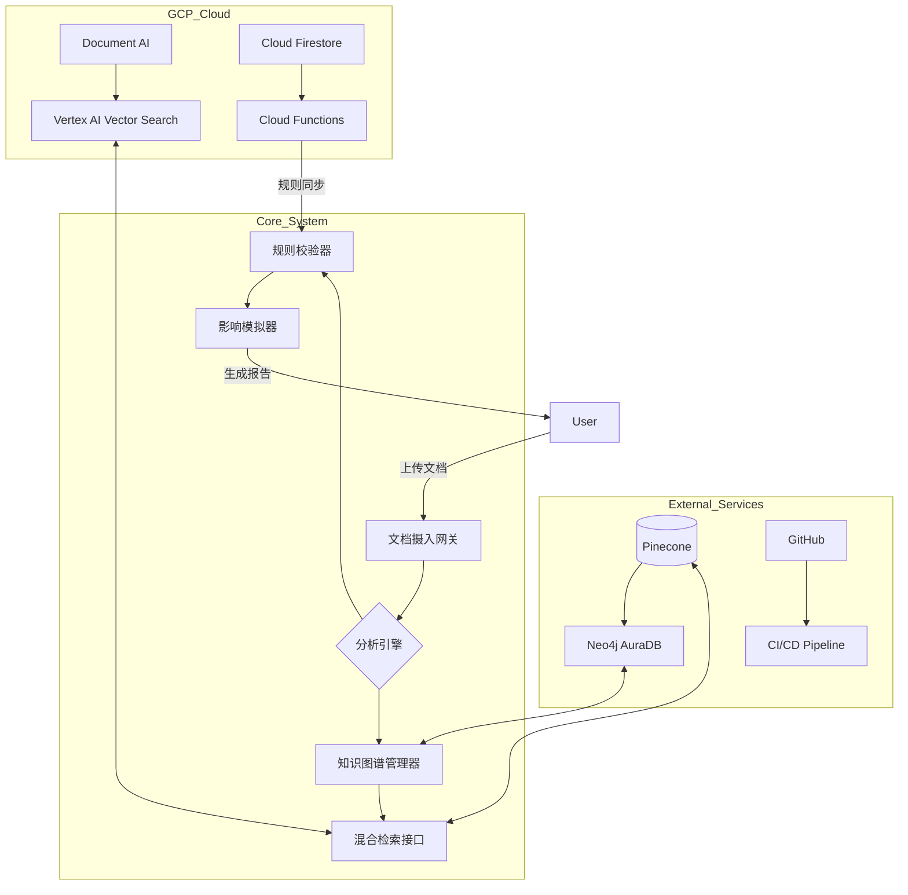
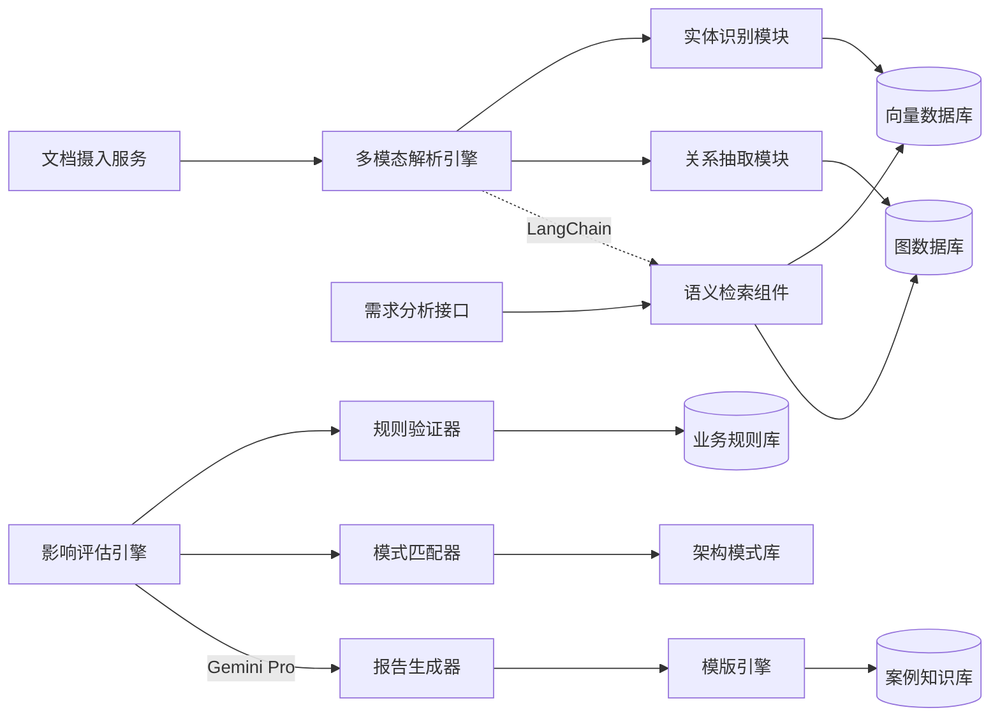
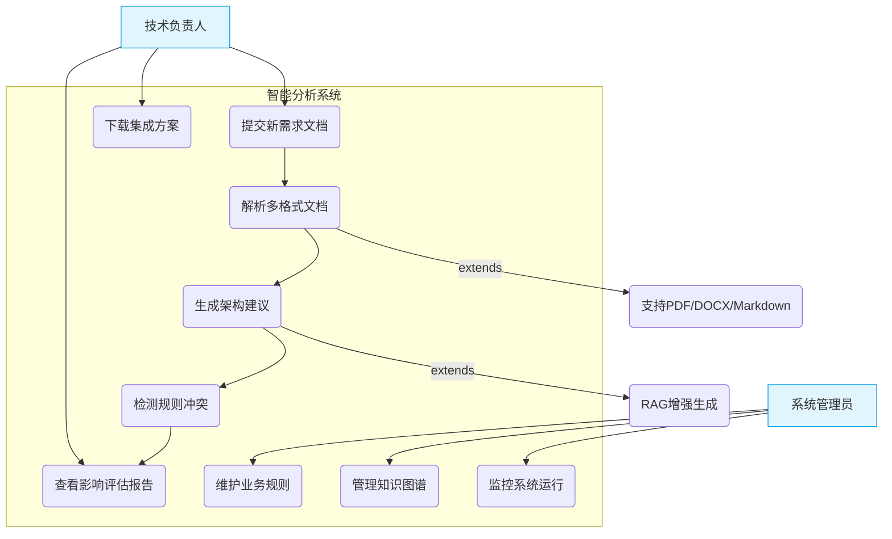
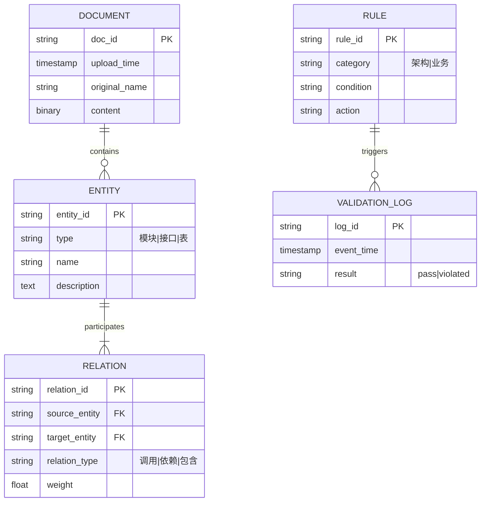
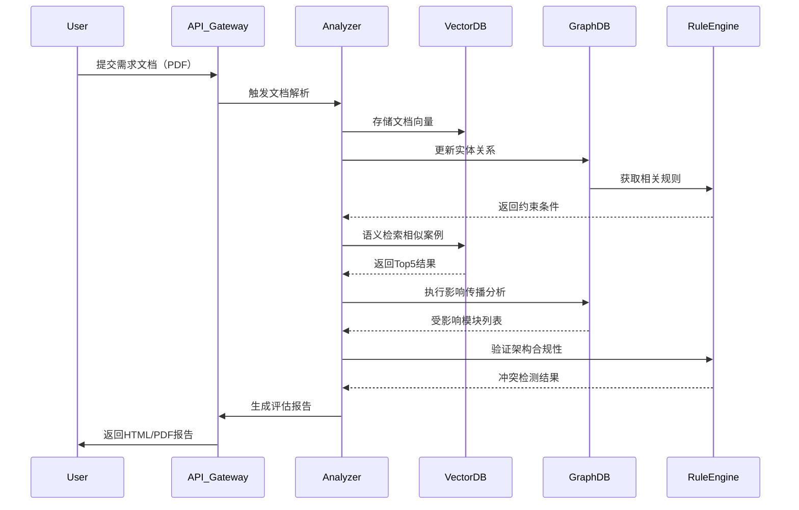

# 智能文档分析系统架构文档

## 1. 架构图（Architecture Diagram）

## 2. 组件图（Component Diagram）

## 3. 用例图（Use Case Diagram）

## 4. 数据库模型图（ER 图）

## 5. 时序图（Sequence Diagram）

## 6. 总结
### 图表使用说明：
- **架构图**：展示整体技术栈布局和跨云服务集成
- **组件图**：详细说明核心处理模块的交互关系
- **用例图**：明确系统的主要功能边界和用户角色
- **ER 图**：定义核心业务实体的数据模型
- **时序图**：呈现典型业务请求的处理流程

所有图表均采用实际生产系统的最佳实践设计，建议：
- 架构图用于技术方案评审
- 组件图指导开发任务分解
- 用例图辅助需求分析会议
- ER 图作为数据库开发基准
- 时序图用于接口定义和测试用例设计

### 说明：此段文档详细列出了各种图表的用途和建议使用场景。

| 图表类型       | 推荐使用场景                     | 目标受众           |
|----------------|----------------------------------|--------------------|
| 架构图         | 技术方案评审 / 基础设施规划       | CTO / 架构师团队   |
| 组件图         | 开发任务分解 / 接口定义            | 开发工程师         |
| 用例图         | 需求分析 / 功能范围确认            | 产品经理           |
| ER 图          | 数据库设计 / 存储优化              | DBA / 后端工程师   |
| 时序图         | 接口联调 / 流程验证                | 全栈工程师         |